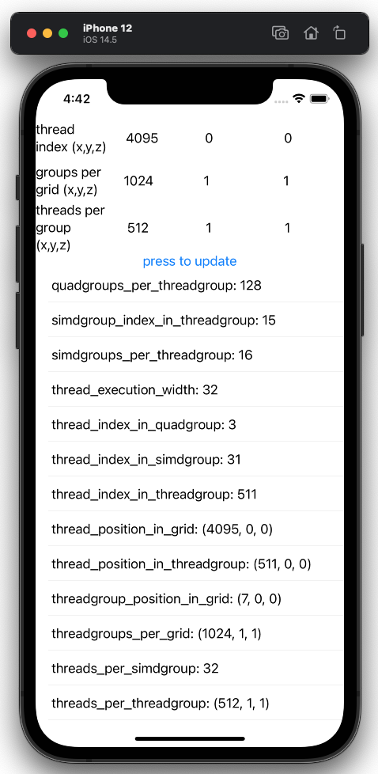

# MetalComputeAttributeChecker

## What it does?
It shows the values of **Kernel Function Input Attributes** as the input parameters to the Metal Compute kernel.
The values are taken in the kernel at the specified thread in the specified configuration.
The thread is specified by the `thread_position_in_grid` attribute.
The configuration is specified by `groups_per_grid` and `threads_per_threadgroup` to 
`dispatchThreadgroups()` of `MTLComputeCommandEncoder`.

It supports both Macos as a command-line tool, and iOS as a UI App.

See https://developer.apple.com/metal/Metal-Shading-Language-Specification.pdf for details.

## How it is useful?
Those attributes of METAL are not so well documented as CUDA counterparts, and I think the best way to learn is to run it on actual devices and see the bevavior.

## Install
### Macos
Open a terminal, go to `MetalComputeAttributeChecker/MetalComputeAttribs/` and `make all`.
The code is written in C++/Obj-C.

### iOS
Open `MetalComputeAttributeChecker/MetalComputeAttribs.xcodeproj` in Xcode.
The code is writtin in SwiftUI.

